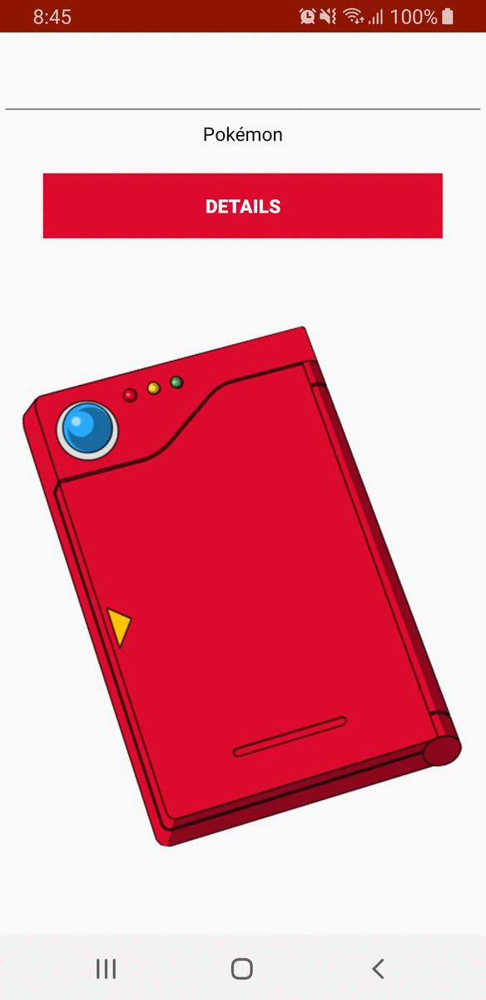

# Exemplo Pokédex
Exemplo simples de uma pokédex utilizando a API PokéAPI.

## Android Versão Mínima
Android 5.0 (API level 21)

## Uso dos seguintes recursos
* Tratamento de campo vazio emitindo aviso
* Utilizada a biblioteca [Ion](https://github.com/koush/ion) (para ler os dados recebidos da API)
* Utilizada a biblioteca [Picasso](https://github.com/square/picasso) (para exibir imagem do pokémon)
* Busca do pokémon enviando a pesquisa para outra [Activity](https://developer.android.com/reference/android/app/Activity) utilizando uma [Intent](https://developer.android.com/reference/android/content/Intent)
* Animações criadas para transição entre Activities
* Utilizado um ícone personalizado
* Uso de um [ProgressBar](https://developer.android.com/reference/android/widget/ProgressBar) enquanto carrega a pesquisa
* [ScrollView](https://developer.android.com/reference/android/widget/ScrollView) para ler o conteúdo caso esteja em modo paisagem ou seja extenso
* Uso de um [Spinner](https://developer.android.com/guide/topics/ui/controls/spinner) para mostrar os movimentos do pokémon
* Verifica se o Pokémon existe retornando o resultado utilizando um [Toast](https://developer.android.com/guide/topics/ui/notifiers/toasts) (caso não encontre)

### Licença
Este repositório está disponível sob a licença [Mozilla Public License, version 2.0](https://github.com/jhonatasrm/exemplo-pokedex/blob/master/LICENSE)
